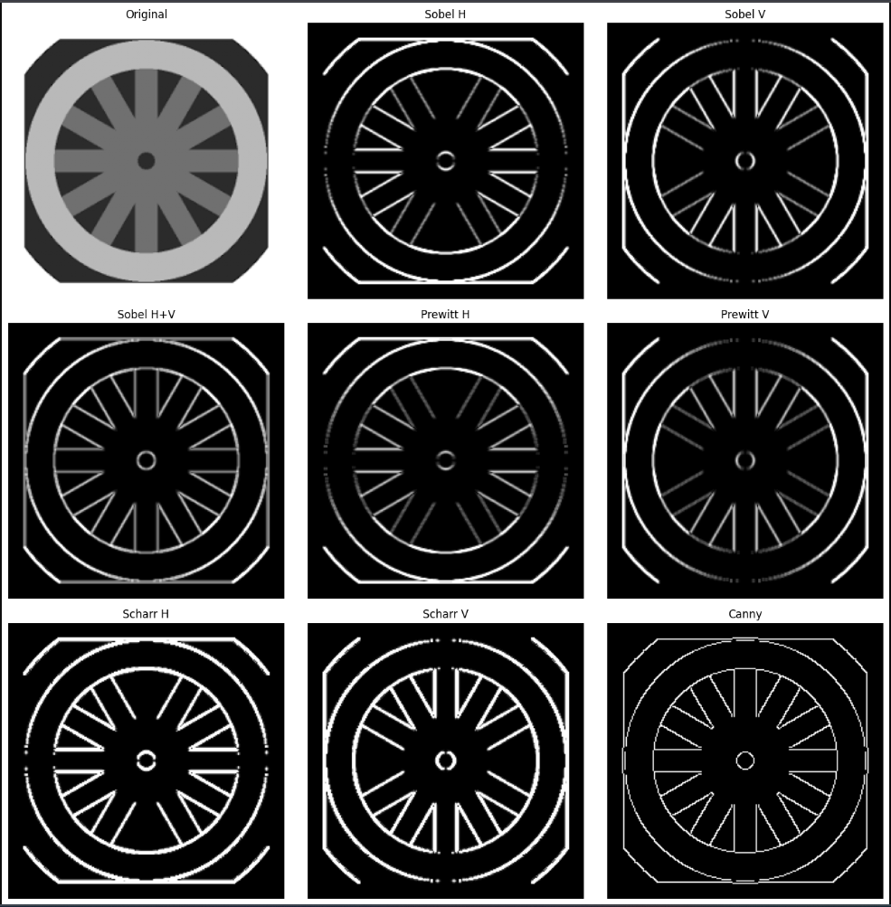

# Computer Vision Edge Detection Project

This project implements various edge detection algorithms using OpenCV and Python. It breaks down the different techniques into separate, modular scripts for easier understanding and execution.



## Project Structure

- **`sobel_edge_detection.py`**: Implements Sobel edge detection, which computes the gradient approximation of image intensity function.
- **`prewitt_edge_detection.py`**: Implements Prewitt edge detection using specific kernels for horizontal and vertical edge detection.
- **`scharr_edge_detection.py`**: Implements Scharr edge detection, which is similar to Sobel but provides better rotational symmetry.
- **`canny_edge_detection.py`**: Implements the Canny edge detector, a multi-stage algorithm known for its optimal edge detection capabilities.
- **`wheel.png`**: The input image used for testing these algorithms (ensure this file is present).

## How to Run

Ensure you have the required dependencies installed:
```bash
pip install opencv-python matplotlib numpy
```

Run each script individually:

```bash
python sobel_edge_detection.py
python prewitt_edge_detection.py
python scharr_edge_detection.py
python canny_edge_detection.py
```

## Business Goals & Applications

Understanding and implementing these edge detection techniques directly supports several key business and industrial objectives:

### 1. Automated Quality Control
In manufacturing, these algorithms can automatically detect defects, cracks, or irregularities in parts (like the wheel in this project). By analyzing edge continuity and geometry, systems can flag defective items without human intervention, reducing costs and improving quality assurance.

### 2. Feature Extraction for Machine Learning
Edge detection is a critical pre-processing step for computer vision models. By reducing an image to its structural edges, we significantly reduce the amount of data to be processed while preserving distinct structural properties. This is essential for training efficient models for object recognition and classification.

### 3. Autonomous Navigation & Robotics
For autonomous vehicles and robots, detecting edges is fundamental to identifying lanes, road boundaries, obstacles, and signs. Algorithms like Canny are often the first step in converting visual input into navigational data.

### 4. Medical Imaging Analysis
In healthcare, edge detection helps in identifying the boundaries of organs, tumors, or other anatomical structures in X-rays, MRIs, and CT scans. Precise edge detection assists radiologists in making accurate diagnoses and planning surgeries.
